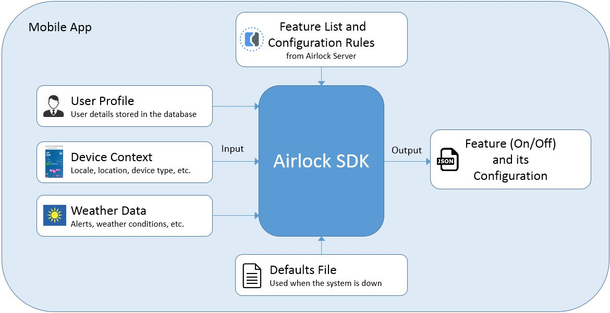
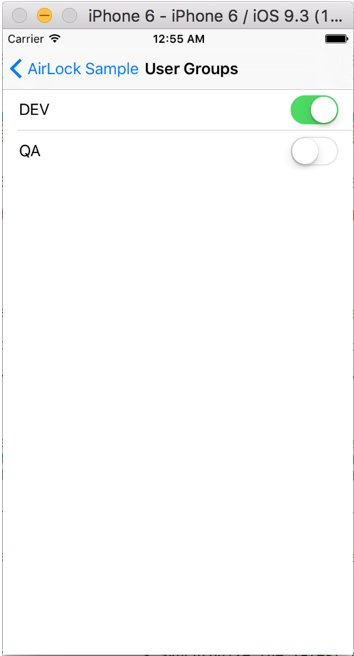

# Airlock SDK for iOS
The Airlock SDK determines which features are enabled for a particular application based on the user profile and device context (locale, location, device type, etc.).

## System Requirements
* iOS 8.0 and later

## Installation

The Airlock SDK is available as a CocoaPod. To install, add the following line to your Podfile:

```ruby
pod 'AirLockSDK'
```

## Configuring your application to use the Airlock SDK
Do the following steps to integrate the Airlock SDK with your iOS project:

1. Open the Airlock Control Center.
2. Go to the **Products** area.
2. In the list of products, select an iOS product, for example: **iOS Flagship App**.
3. In the **Version Ranges** area, click the download button next to the appropriate version range.
4. Select the iOS platform and click the links to download the defaults file (`AirlockDefaults.json`) and constants file (`AirlockConstants.swift`).
7. Add the `AirlockDefaults.json` file to your project as a resource, and add the `AirlockConstants.swift` file as a source to be compiled.

## SDK Overview


The master list of features and configuration rules are stored on the Airlock server (AWS S3). Each feature definition includes rules that determine when the feature is enabled based the user profile, device context (locale, location, device type, etc.), and weather conditions. An application that uses the Airlock SDK provides the user profile, device context information, and weather data to the SDK. The SDK runs rules on that information and determines which features are on or off, and which output configurations are applied. In case of error or when feature and configuration information is not available on the server, the defaults file is used.

## Usage

To use the Airlock SDK, follow these steps:

1. Initialize the SDK by calling the **loadConfiguration** method. This method provides the base URL to the Airlock server and loads the defaults file and any previously stored information from the server. You supply the product version and defaults file to this method.

2. Pull the list of features, their status, and configurations from the server by calling the asynchronous **pullFeatures** method. The **pullFeatures** method downloads the current list of features from the server.

3. Calculate the pull results by calling the **calculateFeatures** method. You supply the following information to this method as a single JSON string: the user profile and the device context (includes the locale, location, device type, etc.).
	
	The **calculateFeatures** method determines whether the features are enabled based on the method’s input, and evaluates the feature’s configuration rules. No feature status changes are exposed until the **syncFeatures** method is called.

3. Make the current feature list available to the code by calling the **syncFeatures** method.
 
4. Use the **getFeature(feature_name).isOn** method to determine whether a feature is on or off. 
	
	A condition statement surrounds every code block that is air-locked. The condition causes the block to run if the feature is enabled:

	````
	if (Airlock.sharedInstance.getFeature(AirlockConstants.<name_space>.<feature_name>).isOn()) {
            // Add feature code here
        }
	````

	**Important:** For air-locked code snippets, ensure that no change will occur in the rest of the application when the feature is turned off. From an execution perspective, the application must run the same way when the feature is turned off as it would if the feature did not exist.

5. Use the `getFeature(feature_name).getConfiguration` method to get the feature's configuration in as a dictionary object. Note that the configuration can contain objects. In other words, the value of a specific key in the configuration can also return a dictionary.

	````
	let feature = AirlockManager.getInstance().getFeature("feature_name")
	if (feature.isOn()){
	
		let config = feature.getConfiguration()
		if let buttonColor = config["buttonColor"] {
		
			if (buttonColor == "red"){
				// Do something when the color is red
			}
		}
	}
	````

6. Optional: Get the feature's children, parent, or all features under the root as follows:
	
	````
	AirlockManager.getInstance().getFeature("feature_name").getChildren()
	AirlockManager.getInstance().getFeature("feature_name").getParent()
	AirlockManager.getInstance().getRootFeatures()
	````

## Setting device user groups

When a feature is the development stage, you control the visibility of the feature by defining internal user groups in Airlock Control Center. Each feature is associated with one or more user groups. The SDK provides a user interface that allows you to associate your device with these user groups.



To integrate this interface into your app, add the following line to the current view controller that is embedded in the navigation controller:

````
AirLockSegue.performSegueToUserGroups(self)
````
This method pushes the user groups view controller onto the caller navigation controller stack and updates the display.


## Example
   
The following sample code calls the methods that are described in the **Usage** section:
````
        let context:String = "" // device context (name-value pair structure in JSON format)
        let productVersion:String = "1.0.0" // the product version number
        
        let configFilePath = NSBundle.mainBundle().pathForResource("AirlockDefaults",ofType:"json")
        guard configFilePath != nil else {
            print("ERROR:Airlock defaults file not found")
            return
        }
        
        do {
            /*
             * Initialize Airlock with default feature values and product version.
             */
            try Airlock.sharedInstance.loadConfiguration(configFilePath!,productVersion:productVersion)
        } catch {
            print("ERROR:Init Airlock:\(error)")
        }
        
        /*
         * Asynchronously brings the new features JSON from AWS S3.
         * Updates LastPullTime
         */
        Airlock.sharedInstance.pullFeatures({ sucess,error in
            
            if(!sucess) {
                print("ERROR:pullFeatures:\(error)")
                return
            }
            
            /*
             * Calculate features based on Context JSON.
             * Updates LastCalculateFeatures
             */
            do {
                try Airlock.sharedInstance.calculateFeatures(context)
            }
            catch {
                print("ERROR:calculateFeatures:\(error)")
                return
            }
            
            do {
                /**
                 * Synchronize the latest calculateFeatures results with the current feature set
                 * Updates LastSyncTime
                 */
                try Airlock.sharedInstance.syncFeatures()
            } catch {
                print("ERROR:syncFeatures:\(error)")
            }
        })
````
